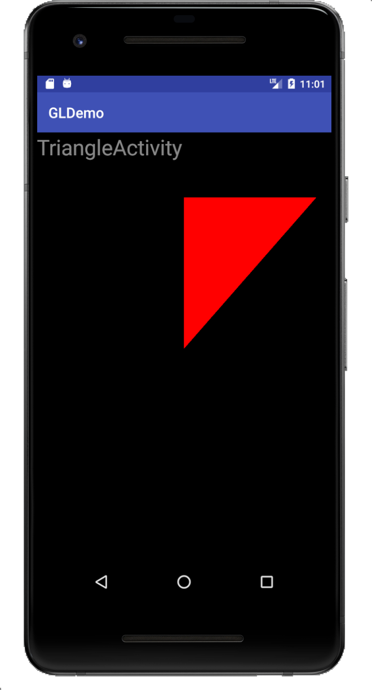
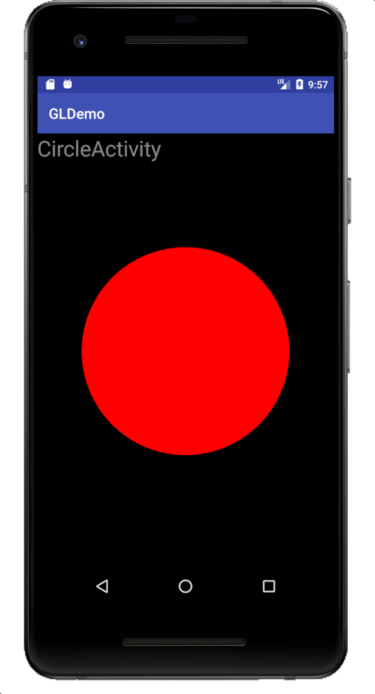
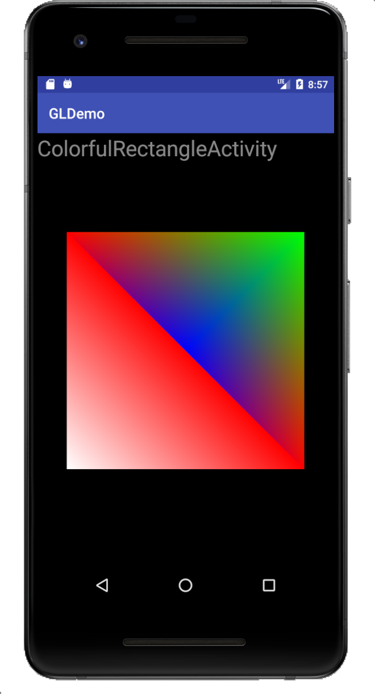

# **Android GL ES**

Android case: draw anything by opengl es on glSurfaceView.

It need to set one renderer which implement GLSurfaceView.Renderer.

Most of out works are in MyRenderer.

MyRenderer has three callback functions. They are onSurfaceCreated, onSurfaceChanged, onDrawFrame separately.

That is android's content above.


### Project 1

#### Description: draw one red triangle

Prepare our vertex shader and fragment shader.

###### Filename: triangle_vertex_shader.glsl

```glsl
attribute vec4 a_Position;

void main()
{
    gl_Position = a_Position;
}
```

###### Filename: triangle_fragment_shader.glsl

```glsl
precision mediump float;

uniform vec4 u_Color;

void main()
{
    gl_FragColor = u_Color;
}
```

As shaders are prepared. Let's complete the remain in java world.

Usually, we set ClearColor in onSurfaceCreated. 

```java
@Override
public void onSurfaceCreated(GL10 gl, EGLConfig config) {
    GLES20.glClearColor(0.0f, 0.0f, 0.0f, 1);
}
```

Take all screen as our canvas, so set viewport in onSurfaceChanged.

```java
@Override
public void onSurfaceChanged(GL10 gl, int width, int height) {
    GLES20.glViewport(0, 0, width, height);
}
```

Clear our screen when we draw everytime, so clear in onDrawFrame.

```java
@Override
public void onDrawFrame(GL10 gl) {
    GLES20.glClear(GLES20.GL_COLOR_BUFFER_BIT | GLES20.GL_DEPTH_BUFFER_BIT);
}
```

Next, let's create gl shaders for our shaders, compile them. In onSurfaceCreated.

```java
int vertexShaderId = GLES20.glCreateShader(GLES20.GL_VERTEX_SHADER);
// TODO check create success or not
GLES20.glShaderSource(vertexShaderId, verCode);
GLES20.glCompileShader(vertexShaderId);
// TODO check compile success or not
```

The same as fragment shader.

```java
int fragmentShaderId = GLES20.glCreateShader(GLES20.GL_FRAGMENT_SHADER);
// TODO check
GLES20.glShaderSource(fragmentShaderId, fragCode);
GLES20.glCompileShader(fragmentShaderId);
// TODO check
```

And then, if all pass, create program and attach shaders and link it.

```java
mGlProgram = GLES20.glCreateProgram();
// TODO check create success or not
GLES20.glAttachShader(mGlProgram, vertexShaderId);
GLES20.glAttachShader(mGlProgram, fragmentShaderId);
GLES20.glLinkProgram(mGlProgram);
// TODO check link success or not
// TODO validate program success or not
GLES20.glUseProgram(mGlProgram);
```

Now, we can get the variants in shader glsl.

```java
m_aPosition = GLES20.glGetAttribLocation(mGlProgram, A_POSITION);
m_uColor = GLES20.glGetUniformLocation(mGlProgram, U_COLOR);
```

Assign them some values.

```java
private static final int POSITION_COMPONENT_COUNT = 2;
float[] tableVertices = {
    0, 0,
    0, 0.7f,
    0.9f, 0.7f,
};

vertexFloatBuffer = ByteBuffer.allocateDirect(tableVertices.length * BYTES_PER_FLOAT)
    .order(ByteOrder.nativeOrder())
    .asFloatBuffer()
    .put(tableVertices);
vertexFloatBuffer.position(0);

GLES20.glVertexAttribPointer(m_aPosition, POSITION_COMPONENT_COUNT, GLES20.GL_FLOAT,
    false, 0, vertexFloatBuffer);
GLES20.glEnableVertexAttribArray(m_aPosition);

GLES20.glUniform4f(m_uColor, 1.0f, 0.0f, 0.0f, 1.0f);
```

Final, draw our triangle in onDrawFrame.

```java
GLES20.glDrawArrays(GLES20.GL_TRIANGLES, 0, 3);
```

We get one red triangle as the below image.




### Project 2

#### Description: draw one red circle

After project1, we wrap GLES20 function.

In project2, we only need to pass in the 2 shaders to get program.

```java
mSimpleProgram = EsUtil.shaderCode2Program(
                ResUtil.readResource2String(mCtx, R.raw.circle_vertex_shader),
                ResUtil.readResource2String(mCtx, R.raw.simple_fragment_shader));
```

There, create shader, compile shader, create program, attach shader, link program.

Show vertex shader.

```glsl
uniform mat4 u_Matrix;
attribute vec4 a_Position;

void main()
{
    gl_Position = u_Matrix * a_Position;
}
```

Show fragment shader.

```glsl
precision mediump float;

uniform vec4 u_Color;

void main()
{
    gl_FragColor = u_Color;
}
```

Obviously, only add one more u_Matrix in vertex shader, other are same with project 1.

Why we need this matrix, in order to adjust to the aspect radio.

Let's see relative code.

Get the uniform mat4 position.

```java
m_uMatix = GLES20.glGetUniformLocation(mSimpleProgram, U_MATRIX);
```

Generate othographic projection.

```java
final float aspectRadio = width > height ? ((float) width / (float) height) : ((float) height / (float) width);
if (width > height) {
    Matrix.orthoM(mProjectionMatrix, 0, -aspectRadio, aspectRadio, -1f, 1f, -1f, 1f);
} else {
    Matrix.orthoM(mProjectionMatrix, 0, -1f, 1f, -aspectRadio, aspectRadio, -1f, 1f);
}
```

Apply the matrix.

```java
GLES20.glUniformMatrix4fv(m_uMatix, 1, false, mProjectionMatrix, 0);
```

Why is that? About Linear Algebra

<span style="color:red">// TODO</span>

And then, we generate the circle datas.

```java
private float[] generate2DCircleFloatArray(GraphicsUtil.Point center, float radius, int 		number) {
	float[] arrayOfCircumference = new float[(number + 1) * 2];
	double pieceOfangle = 2 * Math.PI / number;
	for (int i = 0; i <= number; i++) {
		arrayOfCircumference[i * 2] = (float) (center.x + radius * Math.cos(pieceOfangle * 		       i));
		arrayOfCircumference[i * 2 + 1] = (float) (center.y + radius * 								Math.sin(pieceOfangle * i));
	}
	float[] arrayOfCenter = new float[]{center.x, center.y};
	float[] arrayOf2DCircle = new float[arrayOfCenter.length + 									arrayOfCircumference.length];
	System.arraycopy(arrayOfCenter, 0, arrayOf2DCircle, 0, arrayOfCenter.length);
	System.arraycopy(arrayOfCircumference, 0, arrayOf2DCircle, arrayOfCenter.length, 			arrayOfCircumference.length);
	return arrayOf2DCircle;
}
```

Final, we draw the circle use GLES20.GL_TRIANGLE_FAN.

```java
GLES20.glDrawArrays(GLES20.GL_TRIANGLE_FAN, 0, circleVertices.length / 						POSITION_COMPONENT_COUNT);
```

We get one red circle as the below image.




### Project 3

#### Description: draw one colorful rectangle

Color effect is due to the use of varying in shader.

Like rectangle_vertex_shader.glsl

```glsl
uniform mat4 u_Matrix;
attribute vec4 a_Position;
attribute vec4 a_Color;

varying vec4 v_Color;

void main()
{
    v_Color = a_Color;
    gl_Position = u_Matrix * a_Position;
}
```

Like rectangle_fragment_shader.glsl

```glsl
precision mediump float;

varying vec4 v_Color;

void main()
{
    gl_FragColor = v_Color;
}
```

OpenGL will pass v_Color from vertex_shader to fragment_shader internally.

We set each vertex one sure color.

```java
private float[] rectangleVertices = new float[]{
	// x, y, r, g, b
	-0.8f, 0.8f, 1f, 0f, 0f,
	0.8f, 0.8f, 0f, 1f, 0f,
	0f, 0f, 0f, 0f, 1f,
	0.8f, -0.8f, 1f, 0f, 0f,
	-0.8f, -0.8f, 1f, 1f, 1f,
	-0.8f, 0.8f, 1f, 0f, 0f,
};
```

point(-0.8f, 0.8f) would be set color(1f, 0f, 0f), that is to say it is red.

OK, we need to put data into attributes and enable them.

```java
vertexFloatBuffer = NatBufUtil.allocateFloatBuffer(rectangleVertices);

GLES20.glVertexAttribPointer(m_aPosition, POSITION_COMPONENT_COUNT, GLES20.GL_FLOAT,
	false,
	(POSITION_COMPONENT_COUNT + COLOR_COMPONENT_COUNT) * BYTES_OF_FLOAT,
	vertexFloatBuffer);

GLES20.glEnableVertexAttribArray(m_aPosition);

vertexFloatBuffer.position(POSITION_COMPONENT_COUNT);

GLES20.glVertexAttribPointer(m_aColor, COLOR_COMPONENT_COUNT, GLES20.GL_FLOAT,
	false,
	(POSITION_COMPONENT_COUNT + COLOR_COMPONENT_COUNT) * BYTES_OF_FLOAT,
	vertexFloatBuffer);

GLES20.glEnableVertexAttribArray(m_aColor);
```

Finally, we draw rectangle with GLES20.GL_TRIANGLE_STRIP

```java
GLES20.glDrawArrays(GLES20.GL_TRIANGLE_STRIP, 0,
	rectangleVertices.length / (POSITION_COMPONENT_COUNT + COLOR_COMPONENT_COUNT));
```

We get one colorful rectangle as the below image.



