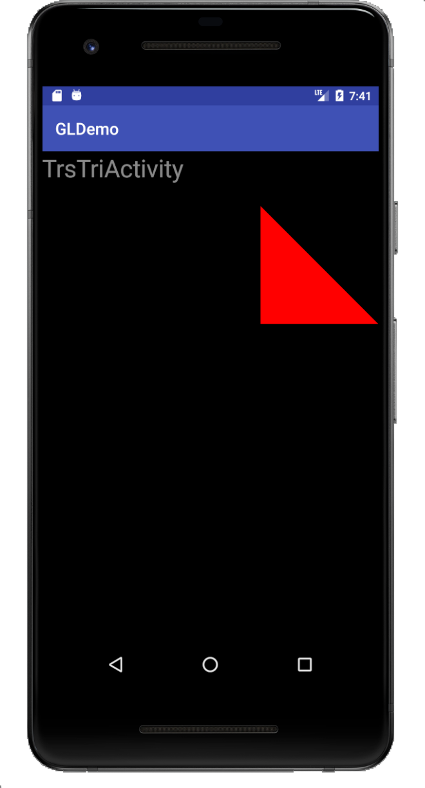
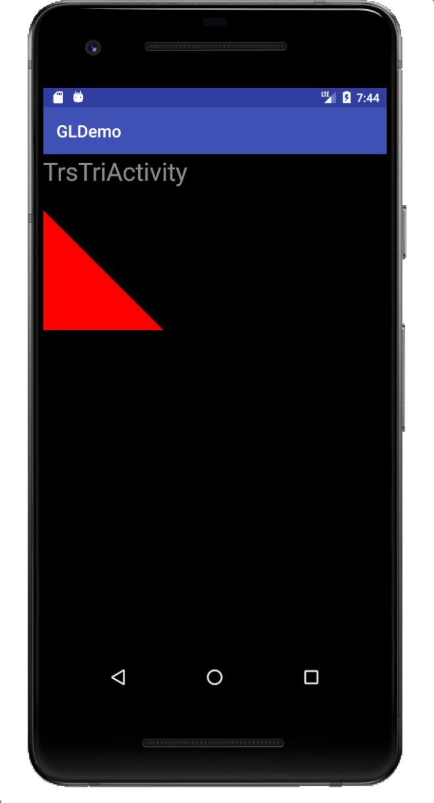
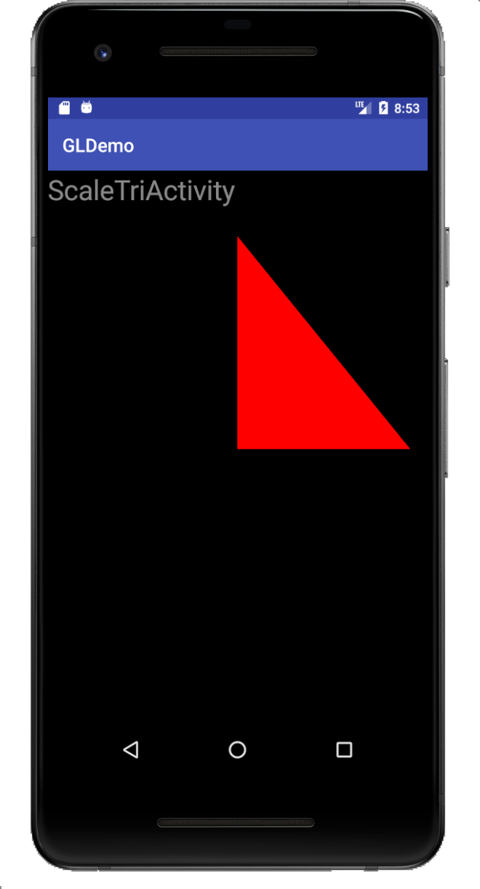
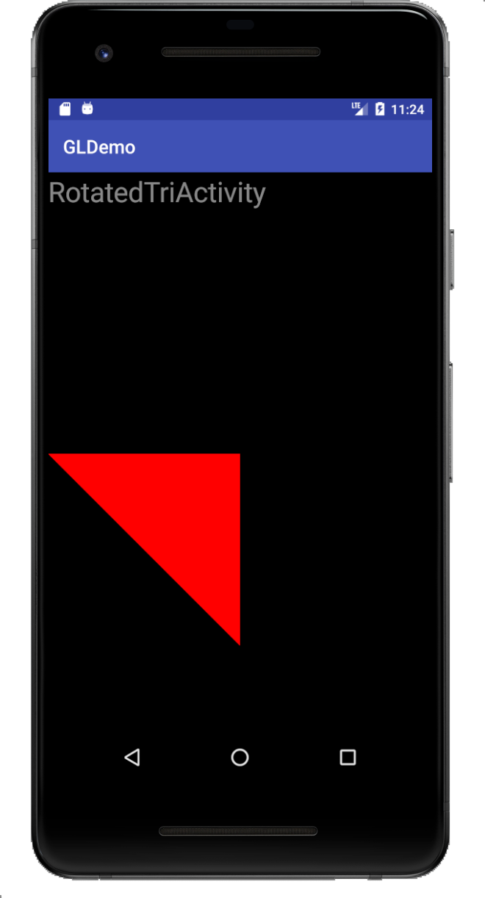
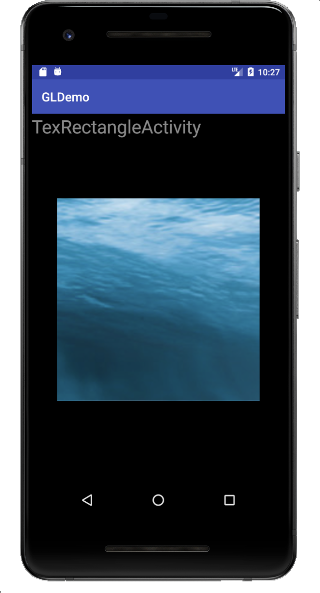

# **Android GL ES**

Android case: draw anything by opengl es on glSurfaceView.

It need to set one renderer which implement GLSurfaceView.Renderer.

Most of out works are in MyRenderer.

MyRenderer has three callback functions. They are onSurfaceCreated, onSurfaceChanged, onDrawFrame separately.

That is android's content above.


### Project 1

#### Description: draw one red triangle

Prepare our vertex shader and fragment shader.

###### Filename: triangle_vertex_shader.glsl

```glsl
attribute vec4 a_Position;

void main()
{
    gl_Position = a_Position;
}
```

###### Filename: triangle_fragment_shader.glsl

```glsl
precision mediump float;

uniform vec4 u_Color;

void main()
{
    gl_FragColor = u_Color;
}
```

As shaders are prepared. Let's complete the remain in java world.

Usually, we set ClearColor in onSurfaceCreated. 

```java
@Override
public void onSurfaceCreated(GL10 gl, EGLConfig config) {
    GLES20.glClearColor(0.0f, 0.0f, 0.0f, 1);
}
```

Take all screen as our canvas, so set viewport in onSurfaceChanged.

```java
@Override
public void onSurfaceChanged(GL10 gl, int width, int height) {
    GLES20.glViewport(0, 0, width, height);
}
```

Clear our screen when we draw everytime, so clear in onDrawFrame.

```java
@Override
public void onDrawFrame(GL10 gl) {
    GLES20.glClear(GLES20.GL_COLOR_BUFFER_BIT | GLES20.GL_DEPTH_BUFFER_BIT);
}
```

Next, let's create gl shaders for our shaders, compile them. In onSurfaceCreated.

```java
int vertexShaderId = GLES20.glCreateShader(GLES20.GL_VERTEX_SHADER);
// TODO check create success or not
GLES20.glShaderSource(vertexShaderId, verCode);
GLES20.glCompileShader(vertexShaderId);
// TODO check compile success or not
```

The same as fragment shader.

```java
int fragmentShaderId = GLES20.glCreateShader(GLES20.GL_FRAGMENT_SHADER);
// TODO check
GLES20.glShaderSource(fragmentShaderId, fragCode);
GLES20.glCompileShader(fragmentShaderId);
// TODO check
```

And then, if all pass, create program and attach shaders and link it.

```java
mGlProgram = GLES20.glCreateProgram();
// TODO check create success or not
GLES20.glAttachShader(mGlProgram, vertexShaderId);
GLES20.glAttachShader(mGlProgram, fragmentShaderId);
GLES20.glLinkProgram(mGlProgram);
// TODO check link success or not
// TODO validate program success or not
GLES20.glUseProgram(mGlProgram);
```

Now, we can get the variants in shader glsl.

```java
m_aPosition = GLES20.glGetAttribLocation(mGlProgram, A_POSITION);
m_uColor = GLES20.glGetUniformLocation(mGlProgram, U_COLOR);
```

Assign them some values.

```java
private static final int POSITION_COMPONENT_COUNT = 2;
float[] tableVertices = {
    0, 0,
    0, 0.7f,
    0.9f, 0.7f,
};

vertexFloatBuffer = ByteBuffer.allocateDirect(tableVertices.length * BYTES_PER_FLOAT)
    .order(ByteOrder.nativeOrder())
    .asFloatBuffer()
    .put(tableVertices);
vertexFloatBuffer.position(0);

GLES20.glVertexAttribPointer(m_aPosition, POSITION_COMPONENT_COUNT, GLES20.GL_FLOAT,
    false, 0, vertexFloatBuffer);
GLES20.glEnableVertexAttribArray(m_aPosition);

GLES20.glUniform4f(m_uColor, 1.0f, 0.0f, 0.0f, 1.0f);
```

Final, draw our triangle in onDrawFrame.

```java
GLES20.glDrawArrays(GLES20.GL_TRIANGLES, 0, 3);
```

We get one red triangle as the below image.


### Project 2

#### Description: draw one red circle

After project1, we wrap GLES20 function.

In project2, we only need to pass in the 2 shaders to get program.

```java
mSimpleProgram = EsUtil.shaderCode2Program(
                ResUtil.readResource2String(mCtx, R.raw.circle_vertex_shader),
                ResUtil.readResource2String(mCtx, R.raw.simple_fragment_shader));
```

There, create shader, compile shader, create program, attach shader, link program.

Show vertex shader.

```glsl
uniform mat4 u_Matrix;
attribute vec4 a_Position;

void main()
{
    gl_Position = u_Matrix * a_Position;
}
```

Show fragment shader.

```glsl
precision mediump float;

uniform vec4 u_Color;

void main()
{
    gl_FragColor = u_Color;
}
```

Obviously, only add one more u_Matrix in vertex shader, other are same with project 1.

Why we need this matrix, in order to adjust to the aspect radio.

Let's see relative code.

Get the uniform mat4 position.

```java
m_uMatix = GLES20.glGetUniformLocation(mSimpleProgram, U_MATRIX);
```

Generate othographic projection.

```java
final float aspectRadio = width > height ? ((float) width / (float) height) : ((float) height / (float) width);
if (width > height) {
    Matrix.orthoM(mProjectionMatrix, 0, -aspectRadio, aspectRadio, -1f, 1f, -1f, 1f);
} else {
    Matrix.orthoM(mProjectionMatrix, 0, -1f, 1f, -aspectRadio, aspectRadio, -1f, 1f);
}
```

Apply the matrix.

```java
GLES20.glUniformMatrix4fv(m_uMatix, 1, false, mProjectionMatrix, 0);
```

Why is that? About Linear Algebra

由于我们的手机屏幕实际不是正方形,而是矩阵,同时还存在横屏和竖屏两个情况.

由于我们在vertex_shader最后写入到gl_Position的点,其实都是在normalized_coordinate坐标系里边的点. 现在由于设备的屏幕形状影响了我们真正输出图形形状. 也就是在normalized_coordinate里边画一个正方形, 屏幕展示出来却是一个长方形.如果画的是一个与normalized_coordinate四条边相切的圆, (-1,1) (1,1) (1,-1) (-1,-1)四个点围起来的四条边,那么真正从屏幕中看到的就会是,与屏幕四条边相切的一个椭圆.显然,并不是我们想要的结果,结果都发生了变形.

那么,我们则想要找到这么一个坐标系,可以画一个圆,出来的就是一个圆,画一个正方形,我们看到的就是一个正方形.我们管这个坐标系叫做virtualized_coordinate.

也就是找到一个矩阵u_matrix, 可以做到u_matrix * virtualized_coordinate = normalized_coordinate.

这个变换矩阵就是orthographic projection matrix
$$
\begin{vmatrix}
2/(right-left) & 0 & 0 & (right + left) / (right - left) \\
0 & 2/(top - bottom) & 0 & (top + bottom) / (top - bottom) \\
0 & 0 & -2 / (far - near) & -(far + near) / (far - near) \\
0 & 0 & 0 & 1
\end{vmatrix}
$$
举例看看效果

假设我们现在是横屏,1920x1080
$$
aspectRadio = 1920 / 1080 \approx 1.78
$$
我们在virtualized_coordinated里边的点(aspectRadio, 1)变换到normalized_coordinate理应是点(1, 1)

代入right = aspectRadio, left = -aspectRadio, top = 1, bottom = -1, far = 1, near = -1.
$$
\begin{vmatrix}
1/aspectRadio & 0 & 0 & 0 \\
0 & 1 & 0 & 0 \\
0 & 0 & -1 & 0 \\
0 & 0 & 0 & 1
\end{vmatrix}
\times
\begin{vmatrix}
aspectRadio \\
1 \\
0 \\
1
\end{vmatrix}
=
\begin{vmatrix}
1 \\
1 \\
0 \\
1
\end{vmatrix}
$$
所以我们在virtualized_coordinated画一个正方形(-1,1) (1,1) (1, -1) (-1, -1)就会在normalized_coordinate中转换成四个点(-0.56, 1) (0.56, 1) (0.56, -1), (-0.56, -1),展现给我们的就是一个正方形. 通过这么一个orthographic projection matrix, 使得我们的图再也不会变形, 圆还是圆, 正方形还是正方形.

<p><a href="https://blog.csdn.net/zzmkljd/article/details/52871561">关于orthographic projection matrix的推导1</a>

<p><a href="https://www.cnblogs.com/davelink/p/5623760.html">关于orthographic projection matrix的推导2</a>

<span style="color:red">// 自己做一个推导过程</span>


And then, we generate the circle datas.

```java
private float[] generate2DCircleFloatArray(GraphicsUtil.Point center, float radius, int 		number) {
	float[] arrayOfCircumference = new float[(number + 1) * 2];
	double pieceOfangle = 2 * Math.PI / number;
	for (int i = 0; i <= number; i++) {
		arrayOfCircumference[i * 2] = (float) (center.x + radius * Math.cos(pieceOfangle * 		       i));
		arrayOfCircumference[i * 2 + 1] = (float) (center.y + radius * 								Math.sin(pieceOfangle * i));
	}
	float[] arrayOfCenter = new float[]{center.x, center.y};
	float[] arrayOf2DCircle = new float[arrayOfCenter.length + 									arrayOfCircumference.length];
	System.arraycopy(arrayOfCenter, 0, arrayOf2DCircle, 0, arrayOfCenter.length);
	System.arraycopy(arrayOfCircumference, 0, arrayOf2DCircle, arrayOfCenter.length, 			arrayOfCircumference.length);
	return arrayOf2DCircle;
}
```

Final, we draw the circle use GLES20.GL_TRIANGLE_FAN.

```java
GLES20.glDrawArrays(GLES20.GL_TRIANGLE_FAN, 0, circleVertices.length / 						POSITION_COMPONENT_COUNT);
```

We get one red circle as the below image.


### Project 3

#### Description: draw one colorful rectangle

Color effect is due to the use of varying in shader.

Like rectangle_vertex_shader.glsl

```glsl
uniform mat4 u_Matrix;
attribute vec4 a_Position;
attribute vec4 a_Color;

varying vec4 v_Color;

void main()
{
    v_Color = a_Color;
    gl_Position = u_Matrix * a_Position;
}
```

Like rectangle_fragment_shader.glsl

```glsl
precision mediump float;

varying vec4 v_Color;

void main()
{
    gl_FragColor = v_Color;
}
```

OpenGL will pass v_Color from vertex_shader to fragment_shader internally.

We set each vertex one sure color.

```java
private float[] rectangleVertices = new float[]{
	// x, y, r, g, b
	-0.8f, 0.8f, 1f, 0f, 0f,
	0.8f, 0.8f, 0f, 1f, 0f,
	0f, 0f, 0f, 0f, 1f,
	0.8f, -0.8f, 1f, 0f, 0f,
	-0.8f, -0.8f, 1f, 1f, 1f,
	-0.8f, 0.8f, 1f, 0f, 0f,
};
```

point(-0.8f, 0.8f) would be set color(1f, 0f, 0f), that is to say it is red.

OK, we need to put data into attributes and enable them.

```java
vertexFloatBuffer = NatBufUtil.allocateFloatBuffer(rectangleVertices);

GLES20.glVertexAttribPointer(m_aPosition, POSITION_COMPONENT_COUNT, GLES20.GL_FLOAT,
	false,
	(POSITION_COMPONENT_COUNT + COLOR_COMPONENT_COUNT) * BYTES_OF_FLOAT,
	vertexFloatBuffer);

GLES20.glEnableVertexAttribArray(m_aPosition);

vertexFloatBuffer.position(POSITION_COMPONENT_COUNT);

GLES20.glVertexAttribPointer(m_aColor, COLOR_COMPONENT_COUNT, GLES20.GL_FLOAT,
	false,
	(POSITION_COMPONENT_COUNT + COLOR_COMPONENT_COUNT) * BYTES_OF_FLOAT,
	vertexFloatBuffer);

GLES20.glEnableVertexAttribArray(m_aColor);
```

Finally, we draw rectangle with GLES20.GL_TRIANGLE_STRIP

```java
GLES20.glDrawArrays(GLES20.GL_TRIANGLE_STRIP, 0,
	rectangleVertices.length / (POSITION_COMPONENT_COUNT + COLOR_COMPONENT_COUNT));
```

We get one colorful rectangle as the below image.


### Project 4

#### Description: draw one equilateral triangle which can be translated

We skip the TrsTriActivity directly, see TrsTriangleRenderer.

Let's look at translate_vertex_shader.glsl, is same as circle_vertex_shader.glsl

```glsl
uniform mat4 u_Matrix;
attribute vec4 a_Position;

void main()
{
    gl_Position = u_Matrix * a_Position;
}
```

Define equilateral triangle

```java
float[] triangleVertices = {
	0, 0,
	0, 0.7f,
	0.7f, 0,
};

m_aPosition = GLES20.glGetAttribLocation(mSimpleProgram, A_POSITION);
vertexFloatBuffer = NatBufUtil.allocateFloatBuffer(triangleVertices);

EsUtil.vertexAttribPointerAndEnable(m_aPosition, POSITION_COMPONENT_COUNT, 				GLES20.GL_FLOAT, false, 0, vertexFloatBuffer);

GLES20.glDrawArrays(GLES20.GL_TRIANGLES, 0, 3);
```

We already prepare a_Position attribute.

Next, set our u_Matrix uniform.

```java
private final float[] mProjectionMatrix = new float[16];
private final float   mTranslateX       = 0.3f;
private final float   mTranslateY       = 0;
private final float[] mIdentityMatrix   = new float[]{
	1f, 0, 0, 0,
	0, 1f, 0, 0,
	0, 0, 1f, 0,
	0, 0, 0, 1f,
};
private final float[] mFinalMatrix      = new float[16];
float[] triangleVertices = {
	0, 0,
	0, 0.7f,
	0.7f, 0,
};

@Override
public void onSurfaceChanged(GL10 gl, int width, int height) {
	GLES20.glViewport(0, 0, width, height);
	final float aspectRadio = width > height ? ((float) width / (float) height) : 			((float) height / (float) width);
	if (width > height) {
		Matrix.orthoM(mProjectionMatrix, 0, -aspectRadio, aspectRadio, -1f, 1f, -1f, 			1f);
	} else {
		Matrix.orthoM(mProjectionMatrix, 0, -1f, 1f, -aspectRadio, aspectRadio, -1f, 			1f);
	}
	Matrix.translateM(mIdentityMatrix, 0, mTranslateX, mTranslateY, 0);
	Matrix.multiplyMM(mFinalMatrix, 0, mIdentityMatrix, 0, mProjectionMatrix, 0);
	GLES20.glUniformMatrix4fv(m_uMatrix, 1, false, mFinalMatrix, 0);
}
```

Because of translating 0.3f on x-axis, the equilateral triangle should be align the right side of screen.

We can compare it with project 1.

We get one align screen right side equilateral triangle as the below image.



If we change mTranslateX from 0.3f to -1f.

We get one align screen left side equilateral triangle as the below image.




### Project 5

#### Description: draw one equilateral triangle which can be scaled

Compare with project 4, only modify one place.

```java
private final float mScaleX = 1.3f;
private final float mScaleY = 1.6f;

Matrix.scaleM(mIdentityMatrix, 0, mScaleX, mScaleY, 1f);
```

We get a scaled triangle as the below image.




### Project 6

#### Description: draw one equilateral triangle which can be rotated

Compare with project 4, only modify one place.

We want the graphic rotated around z-axis, 180°

```java
private final float mAngle = 180f;

Matrix.rotateM(mIdentityMatrix, 0, mAngle, 0f, 0f, -1f);
```

We get a rotated triangle as the below image.




### Project 7

#### Description: draw a texture rectangle

We need to overwrite our shader from rectangle_fragment_shader.glsl and rectangle_vertex_shader.glsl

See our tex_rectangle_vertex_shader.glsl

```glsl
uniform mat4 u_Matrix;
attribute vec4 a_Position;
attribute vec2 a_TextureCoordinates;

varying vec2 v_TextureCoordinates;

void main()
{
    v_TextureCoordinates = a_TextureCoordinates;
    gl_Position = u_Matrix * a_Position;
}
```

And our tex_rectangle_fragment_shader.glsl

```glsl
precision mediump float;

uniform sampler2D u_TextureUnit;
varying vec2 v_TextureCoordinates;

void main()
{
    gl_FragColor = texture2D(u_TextureUnit, v_TextureCoordinates);
}
```

Find the tex attribute and uniform

Generate a new texture id

Set wrap parameter

Set filter parameter

Prepare bitmap data

Load in texture

Bind texture id

Recycle bitmap

Unbind texture id

Generate mipmap

Use number 1 texture unit

```java
private static final String A_TEXTURECOORDINATES = "a_TextureCoordinates";
private static final String U_TEXTUREUNIT        = "u_TextureUnit";

private int         m_aTexturecoordinates;
private int         m_uTextureunit;

public void onSurfaceCreated(GL10 gl, EGLConfig config) {
    
    // find the tex attribute and uniform
	m_uTextureunit = GLES20.glGetUniformLocation(mSimpleProgram, U_TEXTUREUNIT);
	m_aTexturecoordinates = GLES20.glGetAttribLocation(mSimpleProgram, 						A_TEXTURECOORDINATES);
    
    // generate a new texture id
    inal int[] textureObjectIds = new int[1];
	GLES20.glGenTextures(1, textureObjectIds, 0);
    
    // set wrap parameter
	GLES20.glTexParameteri(GLES20.GL_TEXTURE_2D, GLES20.GL_TEXTURE_WRAP_S, 					GLES20.GL_REPEAT);
	GLES20.glTexParameteri(GLES20.GL_TEXTURE_2D, GLES20.GL_TEXTURE_WRAP_T, 					GLES20.GL_REPEAT);
    
    // set filter parameter
    GLES20.glTexParameteri(GLES20.GL_TEXTURE_2D, GLES20.GL_TEXTURE_MIN_FILTER, 				GLES20.GL_LINEAR_MIPMAP_LINEAR);
	GLES20.glTexParameteri(GLES20.GL_TEXTURE_2D, GLES20.GL_TEXTURE_MAG_FILTER, 				GLES20.GL_LINEAR);
    
    // prepare bitmap data
    final BitmapFactory.Options options = new BitmapFactory.Options();
	options.inScaled = false;
	Bitmap bitmap = BitmapFactory.decodeResource(mCtx.getResources(), 						R.drawable.tex128);
	if (bitmap == null) {
		Log.e(TAG, "onSurfaceCreated: decode bitmap failed!");
		return;
	}
    
    // load in texture
	GLUtils.texImage2D(GLES20.GL_TEXTURE_2D, 0, bitmap, 0);
    
    // bind texture id
    GLES20.glBindTexture(GLES20.GL_TEXTURE_2D, textureObjectIds[0]);
    
    // recycle bitmap
	bitmap.recycle();
    
    // unbind texture id
    GLES20.glBindTexture(GLES20.GL_TEXTURE_2D, 0);
    
    // generate mipmap
    GLES20.glGenerateMipmap(GLES20.GL_TEXTURE_2D);
    
    // use number 0 texture unit
	GLES20.glActiveTexture(GLES20.GL_TEXTURE0);
	GLES20.glBindBuffer(GLES20.GL_TEXTURE_2D, textureObjectIds[0]);
	GLES20.glUniform1i(m_uTextureunit, 0);
}
```




